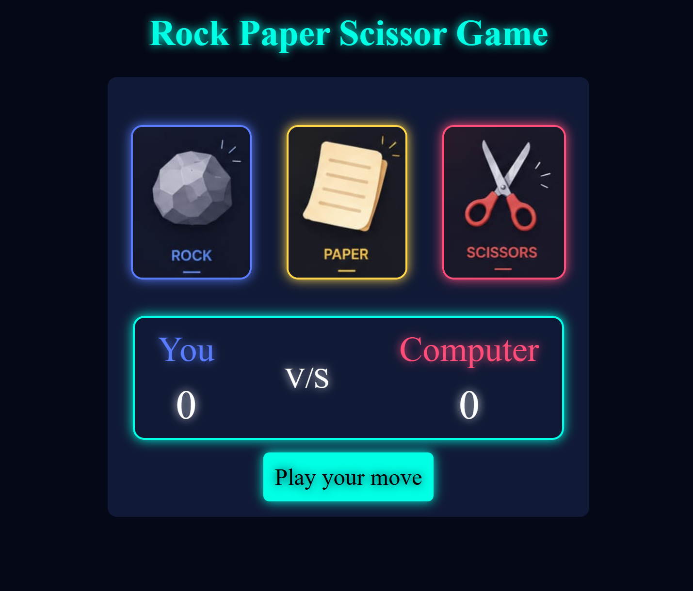
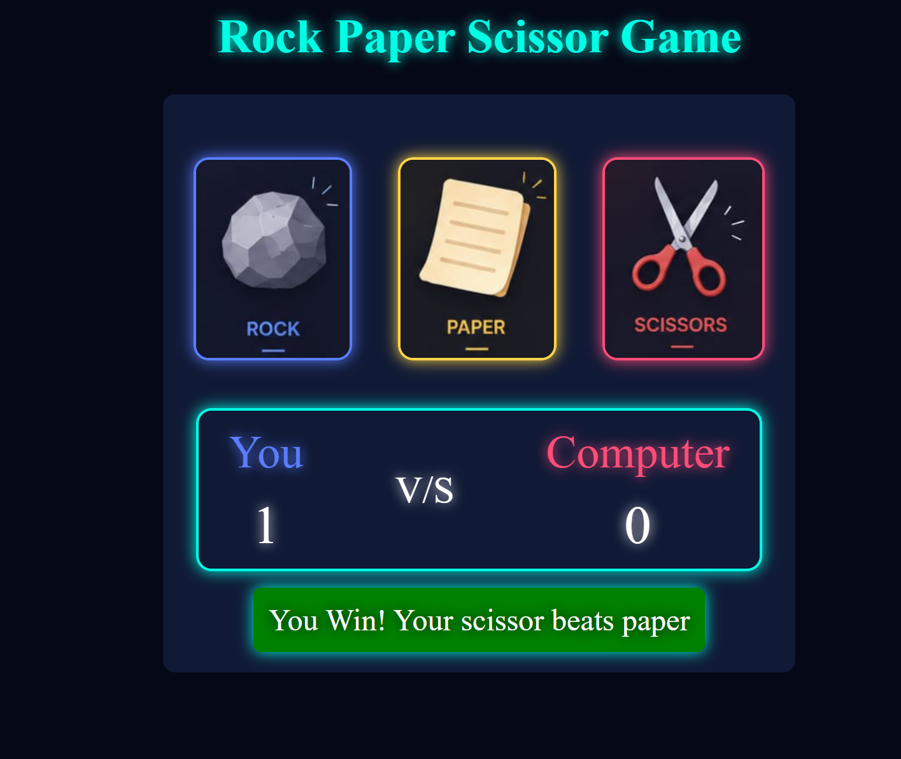
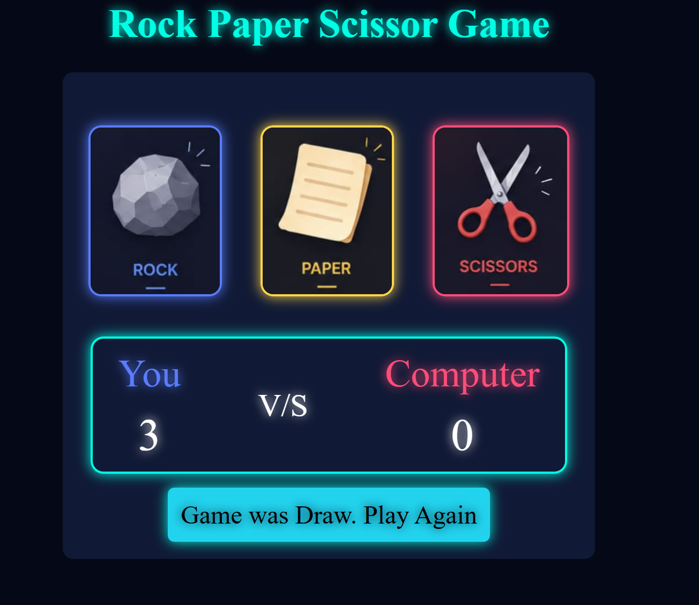

# 🎮 Rock Paper Scissors Game

A modern **Neon-Themed Rock Paper Scissors Game** built using **HTML, CSS, and JavaScript** with glowing UI effects and smooth gameplay interactions.

---

## 🚀 Features

* ✨ Neon glowing UI design
* 🎨 Different glowing colors for:

  * 🪨 Rock → Blue
  * 📄 Paper → Yellow
  * ✂️ Scissors → Pink
* 🧠 Random computer move generator
* 🏆 Live score tracking
* 🔥 Dynamic win/lose/draw messages
* 📱 Responsive design for multiple devices
* ⚡ Smooth hover effects

---

## 📂 Project Structure

```bash
Rock-Paper-Scissors/
│
├── index.html
├── style.css
├── script.js
│
├── images/
│   ├── rock.jpeg
│   ├── paper.jpeg
│   └── scissor.jpeg
│
├── screenshots
|
└── README.md
```

---

## 🛠️ Technologies Used

* HTML5
* CSS3
* JavaScript (Vanilla JS)

---

# 📸 Preview
<p align="center">
  
  
  
  
</p>


# 🎯 How to Play

1. Click on any option:

   * Rock
   * Paper
   * Scissors

2. The computer will randomly choose its move.

3. Rules:

   * Rock beats Scissors
   * Scissors beats Paper
   * Paper beats Rock

4. Scores update automatically.

---

# 🌈 Neon Color Palette

| Element       | Color     | Hex Code  |
| ------------- | --------- | --------- |
| Background    | Dark Navy | `#050816` |
| Main Glow     | Cyan      | `#00FFE5` |
| Rock Glow     | Blue      | `#5A7DFF` |
| Paper Glow    | Yellow    | `#FFD54A` |
| Scissors Glow | Pink      | `#FF4D7A` |
| Draw Color    | Sky Blue  | `#22D3EE` |

---

# 💡 Future Improvements

* 🔊 Add sound effects
* 🎵 Background music
* 🌙 Dark/Light theme toggle
* 🧑 Multiplayer mode
* 📊 Match history tracking
* 📱 Better mobile responsiveness
* 🏅 Winning animations

---

# 🧠 Game Logic

The game logic is written in JavaScript:

* Random computer selection
* Win/Lose condition checking
* Score updating
* Dynamic message rendering

Implemented in:

```javascript
playGame(userChoice)
showWinner(userWin, userChoice, compChoice)
drawGame()
```

---

# ⭐ UI Highlights

* Neon glowing borders
* Hover opacity effects
* Animated game feedback
* Clean centered layout
* Modern gaming-inspired theme

---

# 🙌 Credits

Designed & Developed by **Prajjwal Pandey**
